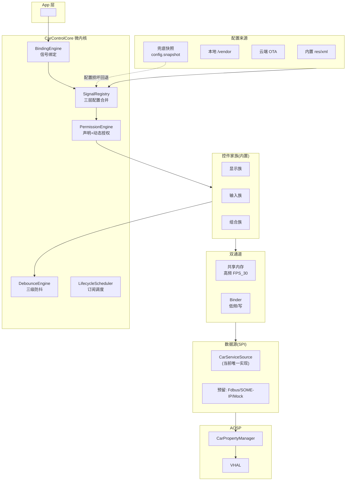
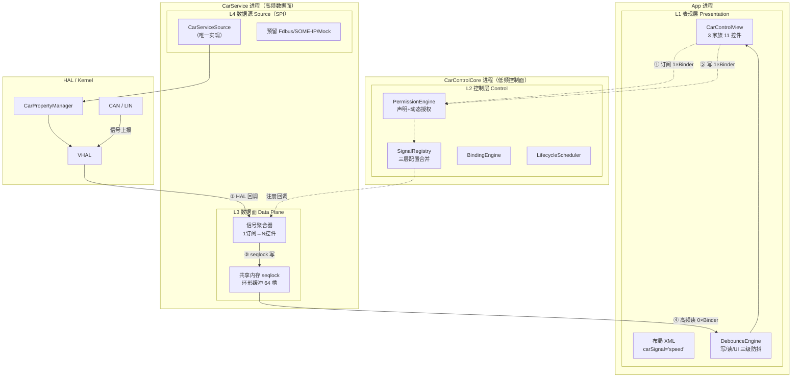
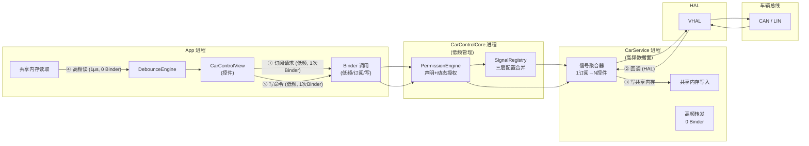
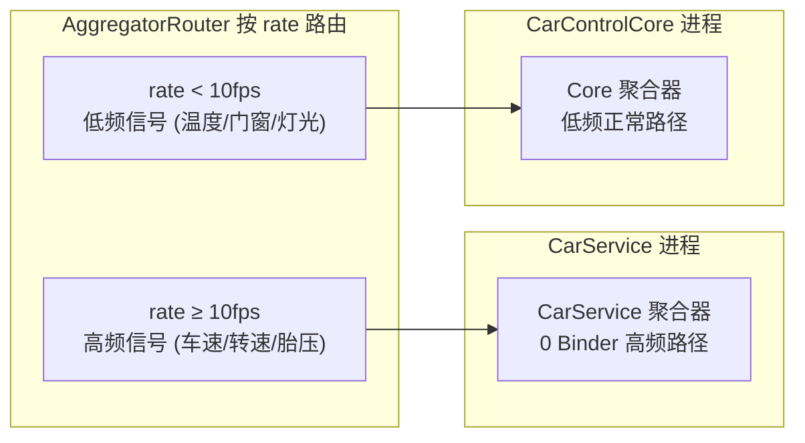
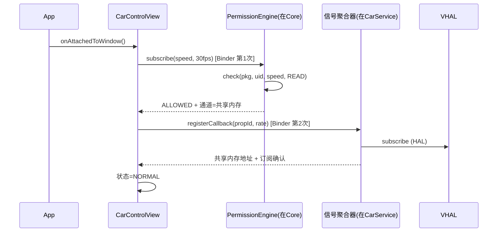
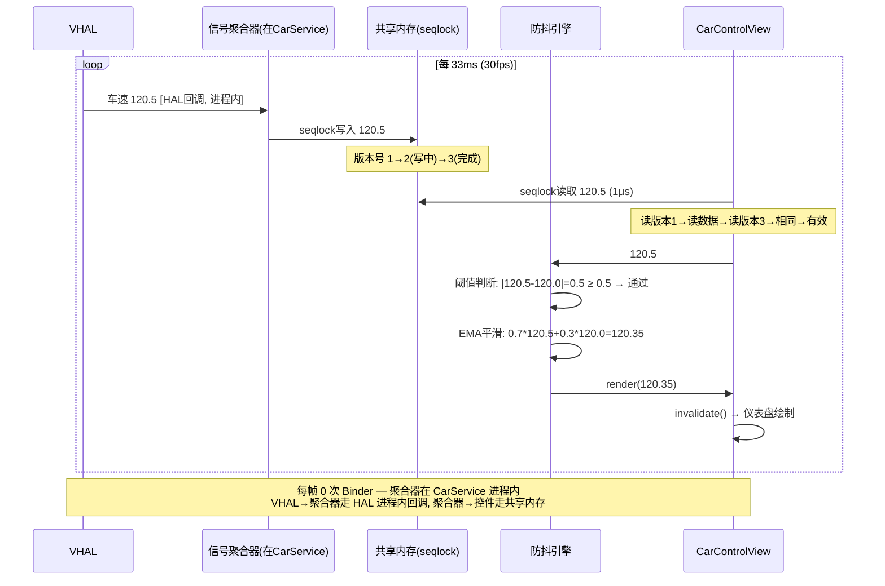
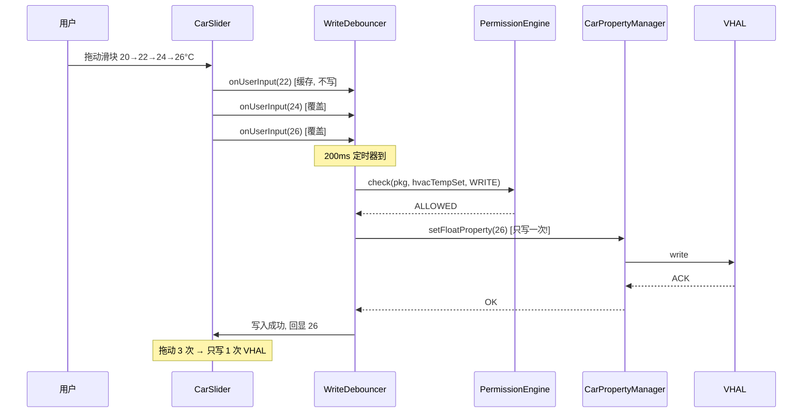
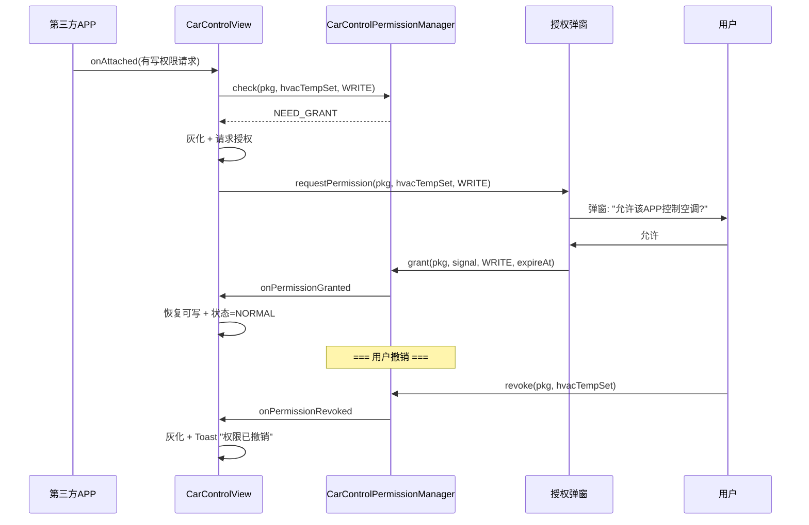
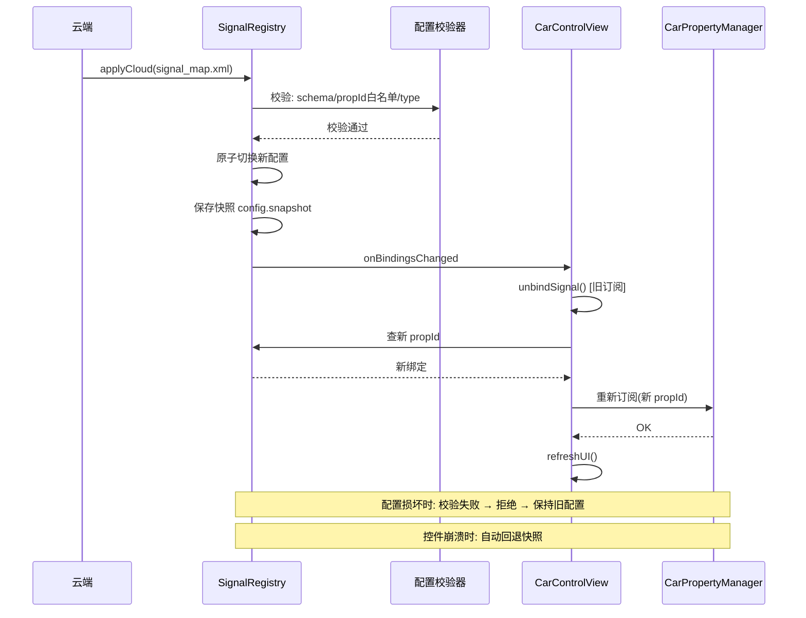
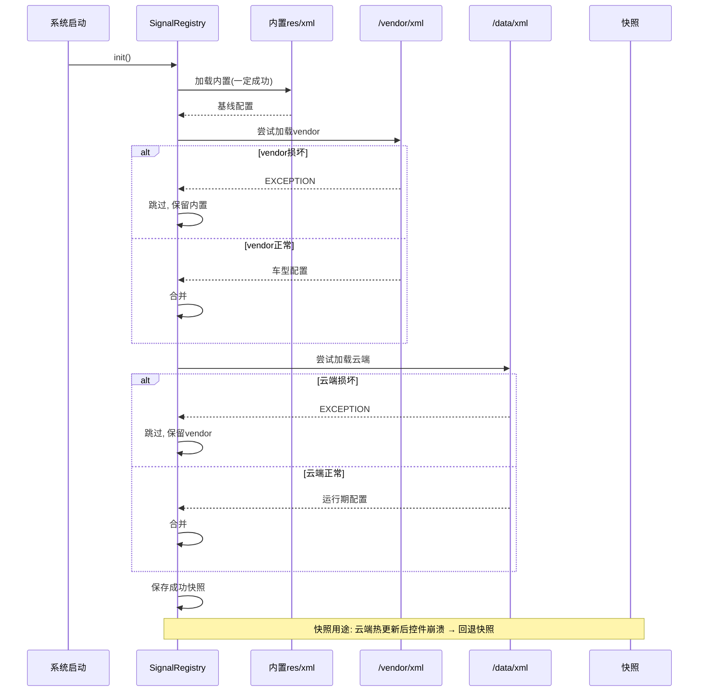

# 车载信号公共控件库 — 架构设计总案

> 定位：面向车载系统的信号绑定公共控件平台

---

### 〇.1 与普通公共控件库的多维度对比

> 「普通公共控件库」指通用/非车载信号的 UI 公共控件库（Material Components、开源组件库、项目内通用 UI 组件）：纯 UI 封装、开发者主动 `setData()`、进程内调用、无信号语义、无跨进程通道、无权限体系。
> 以下 20 个维度，前 12 个为「数据面/架构面」核心差异，后 8 个为「工程/治理面」扩展差异。


| #  | 对比维度               | 普通公共控件库                              | 本库（车载信号公共控件库）                                                  | 差异本质                                       |
| ---- | ------------------------ | --------------------------------------------- | ----------------------------------------------------------------------------- | ------------------------------------------------ |
| 1  | **核心定位与职责边界** | UI 组件复用：按钮/列表/卡片等外观与交互封装 | 信号→UI 的端到端复用与治理：`carSignal` 声明即绑定车辆信号                 | 普通库在「表现层」，本库贯穿「信号层→表现层」 |
| 2  | **数据来源与绑定方式** | 开发者`setData()`/ViewModel 主动喂数据      | XML 声明`carSignal="speed"` 自动订阅 VHAL，零代码                           | 数据获取从「主动推」变「声明即得」             |
| 3  | **数据通道**           | 进程内调用（同进程直接读写）                | 双通道：共享内存（高频）+ Binder（低频/写）                                 | 普通库无跨进程通道，本库打通 App↔CarService   |
| 4  | **高频性能**           | 无特殊优化，回调/通知随主线程               | 高频读每帧**0 次 Binder**、全链路 ~30μs（方案B聚合器下沉，§2.8）          | 性能从「可用」到「可承载 30fps 仪表数据」      |
| 5  | **防抖/稳定性**        | 最多 UI 层防抖（节流/去抖）                 | 三级防抖：写/读/UI（§3），消除总线拥塞与值抖动                             | 从「UI 层面」下沉到「数据链路层面」            |
| 6  | **配置与车型适配**     | theme/硬编码，换主题即改代码                | 三层配置（内置/vendor/云端）+ 快照兜底 + OTA 热生效（§4）                  | 从「发版适配」到「配置热更新」                 |
| 7  | **权限与安全**         | 无权限体系（进程内 UI 无鉴权）              | 声明 + 动态授权 + 可撤销/过期 + dumpsys 审计（§5）                         | 本库承载车辆能力开放，必须信号级授权           |
| 8  | **数据源可扩展**       | 无抽象，数据来源固定                        | SignalSource SPI 预留 Fdbus/SOME-IP/Mock（§6）                             | 从「单一数据源」到「可插拔」                   |
| 9  | **部署形态与进程归属** | 纯 .aar，全在 App 进程                      | .aar + system_server 聚合器 + 共享内存段（§1 架构全景）                    | 普通库零系统依赖，本库需系统侧配合             |
| 10 | **集成与开发门槛**     | 通用易上手，任何 App 可用                   | 前端零代码（XML 声明）但需车载信号知识，且依赖 CarService                   | 门槛从「UI 知识」转为「信号语义知识」          |
| 11 | **生命周期/资源管理**  | View 生命周期（attach/detach）              | 信号订阅 LifecycleScheduler 调度：attach 订阅/detach 取消/不可见降速（§1） | 从「UI 生命周期」扩展到「信号生命周期」        |
| 12 | **可观测性**           | 无内建诊断                                  | dumpsys 信号状态/权限审计/配置生效层（§5、§7 交付物）                     | 本库具备车规级可排查能力                       |
| 13 | **数据语义层**         | 无，值就是值（int/String 裸数据）           | 信号枚举 + 单位/范围/速率语义（`CarSignal`），XML 用语义名                  | 从「裸数据」到「带语义的数据」                 |
| 14 | **数据一致性保障**     | 无，开发者自保证                            | seqlock 防半写 + 共享内存快照一致（§2.8）                                  | 从「尽力一致」到「机制保障一致」               |
| 15 | **跨域/跨进程**        | 不涉及（单进程）                            | 覆盖 Android↔QNX 跨域信号（Fdbus 预留）                                    | 普通库单域，本库多域                           |
| 16 | **状态机与业务语义**   | 无状态概念                                  | StateMachineCapability：状态转移/guard/联动（§2）                          | 从「值展示」到「状态驱动」                     |
| 17 | **多用户/多屏适配**    | 无                                          | 按用户显隐 + 按 display 独立（多屏仪表/中控）                               | 从「单用户单屏」到「多用户多屏」               |
| 18 | **测试能力**           | 手动 mock 数据                              | MockSource 免车开发 + 录播回放（§6 预留）                                  | 从「需真车」到「免车测试」                     |
| 19 | **版本兼容**           | 无版本概念                                  | 信号别名/废弃机制（配置层），新旧 App 并存                                  | 从「强制升级」到「兼容演进」                   |
| 20 | **第三方开放能力**     | 纯内部复用                                  | uses-capability 声明 + License 授权，可对外开放（§5）                      | 从「内部库」到「可开放平台」                   |

**总结论**：

1. **抽象层次不同**：普通库解决「UI 层复用」，本库解决「信号→UI 的**跨进程、高性能、可治理、可开放**」整链路复用——二者不在同一抽象层次。本库在 UI 层可吸收普通库的工程实践（主题化、无障碍、组合控件），但在**数据面（0 Binder 共享内存 + seqlock）、权限面（信号级授权）、配置面（三层热更新）** 是普通库不具备的能力。
2. **本质差异**：普通库是「给数据做 UI 封装」，本库是「把车辆信号变成可声明、可订阅、可治理、可开放的 UI 资产」。开发者面对普通库要自己管数据；面对本库只需声明「我要车速」，剩下全部由平台承担。
3. **价值不在 UI**：本库 UI 部分（控件库）本身不复杂，真正的价值在**数据面性能（0 Binder）、治理能力（权限/配置/审计）、可扩展性（SPI）** 这三层——这是普通控件库永远覆盖不到的，也是车载区别于通用开发的本质。

---

### 〇.2 人力评估（开发人力，不含测试/工具/联调；估算，待业务确认）

> 口径：**开发人力**（架构 + Framework 开发 + App/UI 开发）
> 1 人月 ≈ 22 人天。下表为规划级估算，依据为同类车载中间件/控件模块开发经验类比。


| 工作包                                       |  架构  | Framework 开发 | App/UI 开发 | 小计(人天) | 估算依据                    |
| ---------------------------------------------- | :------: | :--------------: | :-----------: | :----------: | ----------------------------- |
| 1. 架构设计与接口冻结                        |   5   |       3       |      1      |     9     | 契约接口、分层图、评审 2 轮 |
| 2. CarControlCore（注册+权限+防抖+生命周期） |   3   |       15       |      0      |     18     | system_server 侧核心逻辑    |
| 3. CarServiceSource                          |   2   |       8       |      0      |     10     | VHAL 订阅 + 属性映射        |
| 4. HighFreqChannel（共享内存+seqlock）       |   3   |       10       |      0      |     13     | 🔴 技术风险最高，含竞态调试 |
| 5. 控件库 .aar（3 家族 11 控件）             |   2   |       6       |     26     |     34     | UI 工作量主体，含迭代       |
| 6. 配置体系（三层+快照+OTA 热更新）          |   3   |       10       |      0      |     13     | 校验/回退/热生效            |
| 7. 权限管理                                  |   2   |       6       |      1      |     9     | 声明+动态授权+审计          |
| **合计**                                     | **20** |     **58**     |   **28**   |  **106**  | **≈ 4.8 人月**             |

**结论**：纯开发人力约 **106 人天 ≈ 4.8 人月**（1 架构 + 2.6 FW + 1.3 UI）。

### 〇.3 时间排期（核心开发阶段，与人力口径一致；建议排期，待业务确认）

> 口径：与 §〇.2 纯开发人力对应，仅含**核心开发阶段**（M1-M4）；联调/压测/车型落地为独立阶段另行排期（见附注）。
> 关键路径为「聚合器下沉 + 共享内存 seqlock」高频 0 Binder 链路（技术风险最高，先打通）。


| 阶段                 | 周期(周) | 关键交付物                                  | 里程碑                              | 依赖 | 风险                       |
| ---------------------- | :---------: | --------------------------------------------- | ------------------------------------- | ------ | ---------------------------- |
| M1 架构与接口冻结    |     2     | 契约接口基线、分层图、信号枚举              | 架构评审通过                        | 无   | 需求变更                   |
| M2 核心链路打通      |     3     | 聚合器下沉 + 共享内存 seqlock 0 Binder 链路 | Perfetto 验证高频读 0 Binder/~30μs | M1   | 🔴 seqlock 竞态、AOSP 侵入 |
| M3 控件库+配置体系   |     5     | 3 家族 11 控件 .aar + 三层配置+快照         | 控件 demo 可跑通                    | M2   | UI 工作量大（最大单包）    |
| M4 权限              |     2     | 权限管理（声明+动态授权+审计）              | 权限审计可用                        | M2   | 授权流程复杂度             |
| **合计（核心开发）** | **12 周** |                                             |                                     |      | ≈**3 个自然月**           |

**附注（独立阶段，另行排期）**：

- M5 联调/性能压测（全链路联调 + 30fps 压测 + 权限用例）：约 3 周
- M6 试运行/车型落地（首车型 D7 适配 + 验收门禁）：约 2 周
- 若纳入 M5+M6，总周期 ≈ **17 周 ≈ 4 个自然月**（与合并人力 ≈7-8 人月对应）

**关键路径说明**：M2 的「聚合器下沉 + seqlock」决定 0 Binder 目标是否成立，M3 控件库是 UI 工作量主体，两者并行后汇入 M5 联调。若 HighFreqChannel 技术验证延期，整体顺延（M2 为缓冲点）。

## 方案优点与商业价值

### 方案优点


| 维度               | 优点                                                                                          | 依据          |
| -------------------- | ----------------------------------------------------------------------------------------------- | --------------- |
| **高性能**         | 高频读每帧 0 次 Binder（方案B 聚合器下沉 CarService），全链路 ~30μs；共享内存 seqlock 防半写 | §2.3 / §2.8 |
| **低耦合·可扩展** | SignalSource SPI 预留 Fdbus / SOME-IP / Mock，数据源可插拔，QNX/以太网/测试场景按需启用       | §6           |
| **高可靠**         | 三层配置（内置/vendor/云端）+ 快照兜底，配置损坏自动回退、控件显示 DISCONNECTED 不崩溃        | §4           |
| **稳定性**         | 三级防抖（写/读/UI）：写合并减少总线拥塞，读阈值+EMA 消除跳动，UI 合并减少无效重绘            | §3           |
| **安全性**         | 第三方声明 + 动态授权（弹窗/可撤销/可过期）+ 写操作审计（dumpsys），信号×读写双维控制        | §5           |
| **可维护性**       | 信号/防抖/权限参数全部 XML 化，云端 OTA 热更新，控件自动重建订阅，无需重启                    | §2.6         |
| **开发者体验**     | 前端零代码：XML 声明即用，3 家族 11 控件开箱即用，MockSource 免车开发测试                     | §0-§1       |

### 价值


| 价值点                 | 说明                                                                                | 量化                                 |
| ------------------------ | ------------------------------------------------------------------------------------- | -------------------------------------- |
| **缩短车型适配周期**   | 车型差异只改配置 XML + 云端 OTA，无需改代码重编译重发版；propId/base 差异走配置覆盖 | 从"周级发版"到"分钟级热生效"         |
| **降低集成与研发成本** | .aar 控件库 + 3 家族 11 控件跨车型复用，第三方 App 一行 XML 接入，减少重复开发      | 单车型接入工时大幅下降（待业务确认） |
| **提升座舱用户体验**   | 仪表盘平滑无闪烁（EMA+阈值）、写入防抖响应稳定，降低"卡顿/跳变"类售后投诉           | 待业务确认                           |
| **降低运维/售后成本**  | 远程配置热更新 + 快照自动回退 + dumpsys 审计，现场问题无需整包 OTA 即可定位与规避   | 待业务确认                           |
| **平台可迁移性**       | SPI 数据源支撑 QNX / 以太网 / SOME-IP 演进，控件库与 UI 层解耦，保护技术投资        | 跨平台复用                           |
| **开放生态潜力**       | 第三方声明+动态授权机制为"能力开放平台"铺路，可支撑应用商店级能力变现模式           | 商业模式待探索                       |

> 注：上表"待业务确认"的量化指标（节省工时百分比、售后成本降低额、投诉率下降等）需基于实际车型项目数据评估后补充，本方案不虚构数字。

---

## 一句话

**内置控件库（3 家族）+ CarService 数据源（SPI 预留扩展）+ 三层配置（快照兜底）+ 三级防抖（写/读/UI）+ 第三方权限管理（授权可撤销）+ 双通道（共享内存高频/Binder 低频）。** 五条决策全部固化，6 张时序图覆盖订阅/高频读/写防抖/权限/热更新/兜底六条链路。关键优化：聚合器下沉 CarService 进程，高频读链路每帧 **0 次 Binder**（订阅 2 次一次性，写 1 次），架构可以进入落地实施阶段。

## 第一部分：架构全景



### 1.2 分层架构图

> 权威矢量图：`CarService公共控件库-分层架构图.drawio`（进程 × 分层 × 双通道，可在 draw.io 中直接打开编辑）。
> 进程 × 分层双维度：5 层 4 进程，严格对应方案B（聚合器下沉 CarService 进程、0 Binder）。
> 图例：**实线 = 数据面（高频，共享内存，0 Binder）**；**虚线 = 控制面（低频，Binder，订阅/写各 1 次）**。




**架构原则**：

1. **依赖单向**：上层依赖下层，下层不反向依赖上层（App → 控制层 → 数据面 → 数据源 → HAL）。
2. **控制面与数据面解耦**：低频控制（订阅/写，Binder）与高频数据（读，共享内存）分属不同通道，互不阻塞。
3. **数据源可插拔**：L4 通过 SignalSource SPI 依赖倒置，CarServiceSource 为唯一实现，Fdbus/SOME-IP/Mock 预留即插即用。

---

## 第二部分：时序与通讯链路

### 2.1 完整通讯链路图（方案B：聚合器下沉 CarService 进程）

> 关键决策：高频信号聚合器 + 权限校验 + 共享内存写入，全部内置于 CarService 进程。
> 目的：高频读链路每帧 **0 次 Binder**。



### 2.1b 方案选型：方案A vs 方案B vs 双聚合器

> 纯方案B（上图）有代价：聚合器绑死 CarService 进程、需侵入 AOSP。
> 车载实际是"少数高频 + 多数低频"，推荐**双聚合器**折中。


| 维度             | 方案A（聚合器在独立Core） | 方案B（下沉CarService） |   **双聚合器（推荐）**   |
| ------------------ | :-------------------------: | :-----------------------: | :-------------------------: |
| 高频读延迟       |           ~1ms           |         ~30μs         |   **~30μs（高频走B）**   |
| 高频读 Binder/帧 |           1 次           |          0 次          |    **0 次（高频走B）**    |
| 写 Binder        |           2 次           |          1 次          |      2 次（低频走A）      |
| 与 AOSP 解耦     |          ✅ 不改          |         ❌ 需改         |     ⚠️ 只改高频部分     |
| 独立演进         |            ✅            |           ❌           |     ✅ 低频聚合器独立     |
| 故障隔离         |            ✅            |          ⚠️          | ✅ 低频隔离，高频影响面小 |
| 实现难度         |            中            |           高           |     中高（复用两者）     |



```java
// 双聚合器路由: 按信号 rate 决定走哪个聚合器
public class AggregatorRouter {
    private static final float HIGH_FREQ_THRESHOLD = 10f; // 10fps 为界

    // rate >= 10fps → CarService 内聚合器 (方案B, 0 Binder)
    // rate < 10fps  → Core 内聚合器 (方案A, 解耦)
    public void route(CarSignal signal, float rate) {
        if (rate >= HIGH_FREQ_THRESHOLD) {
            carServiceAggregator.subscribe(signal);  // 高频: 进程内, 0 Binder
        } else {
            coreAggregator.subscribe(signal);        // 低频: 正常 Binder 路径
        }
    }
}
```

**双聚合器收益**：

- 高频 3-5 个信号（车速/转速/胎压）→ 走 CarService 聚合器，性能拉到极致（0 Binder）
- 低频 30+ 个信号 → 走 Core 聚合器，保持架构解耦、独立演进
- 侵入 AOSP 的代码量最小（只处理少数高频信号）

### 2.2 时序1: 控件初始化与订阅（低频，1 次 Binder）



> 订阅共 **2 次 Binder**（一次性，不是每帧）。
> 优化点：若权限在 CarService 也缓存，可降到 1 次。

### 2.3 时序2: 高频信号读取（0 次 Binder）



### 2.4 时序3: 写命令（Binder + 写入防抖）



### 2.5 时序4: 权限校验全流程



### 2.6 时序5: 配置热更新（云端下发 → 控件重建）



### 2.7 时序6: 配置兜底（三层回退）



### 2.8 通讯链路延迟与 Binder 次数表


| 链路                  | 通道        |    延迟    | Binder次数 | 场景         |
| ----------------------- | ------------- | :----------: | :----------: | -------------- |
| 控件→Core 订阅       | Binder      |    ~1ms    |  **1次**  | 注册时一次性 |
| Core→CarService 注册 | Binder      |    ~1ms    |  **1次**  | 注册时一次性 |
| 订阅合计              | —          |     —     |  **2次**  | 仅 attach 时 |
| CarService→VHAL      | HAL         |   ~0.5ms   |     0     | 属性订阅     |
| VHAL→聚合器 回调     | HAL(进程内) |   ~0.5ms   |   **0**   | 高频上报     |
| 聚合器→共享内存      | 写          |   ~1μs   |     0     | 高频写       |
| 共享内存→控件        | 读          |   ~1μs   |     0     | 高频读       |
| **高频读全链路/帧**   | 共享内存    | **~30μs** | **0次** ✅ | 车速30fps    |
| 写命令                | Binder      |    ~1ms    |  **1次**  | 防抖后写     |
| **低频写全链路/次**   | Binder      |    ~3ms    |  **1次**  | 温度控制     |

**Binder 次数结论（方案B）**：

```
订阅(一次性):  2 次 Binder
高频读(每帧):  0 次 Binder  ← 核心收益
写(每次):      1 次 Binder
```

> 对比方案A（聚合器在独立 Core 进程）：高频读每帧 1 次 Binder。
> 方案B 将聚合器下沉 CarService 进程，高频链路完全走 HAL 回调 + 共享内存，0 Binder。

---

## 第三部分：控件防抖机制（三级）

防抖不是单一的，分三个层面，分别解决不同抖动：

### 1. 写入防抖（Write Debounce）— 防止高频写

```java
// 场景: 用户拖动温度滑块 → 手指移动 50 次 → 触发 50 次写 VHAL
// 结果: 总线拥塞 + 空调响应混乱

public class WriteDebouncer {
    private final int mIntervalMs;       // 写间隔 (200ms 默认)
    private Object mPendingValue;        // 待写入的最新值
    private long mLastWriteTime;

    // 用户拖动 → 只缓存最新值, 不立即写
    public void onUserInput(Object value) {
        mPendingValue = value;   // 覆盖旧值, 只保留最后
    }

    // 定时器每 200ms: 只写一次最新值
    public void tick() {
        if (mPendingValue != null && now() - mLastWriteTime > mIntervalMs) {
            write(mPendingValue);       // 写一次
            mPendingValue = null;
            mLastWriteTime = now();
        }
    }
}

// 效果: 拖动 50 次 → 只写 1-2 次 VHAL
```

### 2. 读取防抖（Read Debounce）— 防止值抖动

```java
// 场景: 车速 119.8 → 120.2 之间来回跳 → 数字/图标闪烁
// 结果: 视觉疲劳 + 无意义刷新

public class ReadDebouncer {
    private float mLastStable;
    private float mThreshold = 0.5f;    // 变化小于 0.5 不刷新

    public float apply(float raw) {
        if (Math.abs(raw - mLastStable) >= mThreshold) {
            mLastStable = raw;
            return raw;
        }
        return mLastStable;             // 抖动值 → 不更新
    }
}

// EMA 平滑 (仪表盘):
public class EmSmoothed {
    private float mValue;
    private final float mAlpha = 0.7f;
    public float apply(float raw) {
        mValue = mValue == 0 ? raw : mAlpha * raw + (1 - mAlpha) * mValue;
        return mValue;
    }
}
```

### 3. UI 防抖（UI Debounce）— 防止重复渲染

```java
// 场景: 30fps 信号 + 每帧 invalidate → 即使值没变也重绘
// 结果: CPU 浪费

public class UiDebouncer {
    private boolean mPending = false;
    private int mLastRendered;
    private boolean mScheduled;

    // 值变化 → 标记需要重绘, 但合并到同一帧
    public void requestRender(int value) {
        if (value != mLastRendered) {
            mPending = true;
            if (!mScheduled) {
                postOnNextFrame(() -> {
                    if (mPending) { invalidate(); mPending = false; }
                    mScheduled = false;
                });
                mScheduled = true;
            }
        }
    }
}
```

### 防抖配置（XML 可调）

```xml
<!-- 每个信号可配防抖参数, 默认值合理, 特殊场景覆盖 -->
<signal
    name="speed"
    base="sysGlobalFloat"
    id="0x0203"
    debounce-write-ms="0"        <!-- 车速只读, 无写防抖 -->
    debounce-read-threshold="0.5" <!-- 变化<0.5km/h 不刷新 -->
    smooth="ema" />               <!-- EMA 平滑 -->

<signal
    name="hvacTempSet"
    base="sysZoneFloat"
    id="0x0205"
    debounce-write-ms="200"      <!-- 拖动合并, 200ms 写一次 -->
    debounce-read-threshold="0.1"
    smooth="none" />              <!-- 温度直接显示 -->
```

---

## 第四部分：配置本地 + 云端，层层兜底

### 三层来源 + 快照兜底

```
优先级: 云端(③) > 本地/vendor(②) > 内置(①) > 快照(④, 最后兜底)

① 内置 res/xml/car_signals.xml     — APK 自带, 永远存在
② /vendor/etc/car/signal_map.xml  — 出厂烧录车型适配
③ /data/system/signal_map.xml     — OTA 云端下发
④ config.snapshot.xml             — 上一次成功运行的配置快照
```

### 兜底机制（每层都防）

```java
public class SignalRegistry {

    public static void init(Context ctx) {
        // 1. 先加载内置 (一定成功)
        Map<CarSignal, SignalBinding> current = loadBuiltin(ctx);

        // 2. 尝试 /vendor (失败→跳过, 保留内置)
        try {
            merge(current, loadVendor());
        } catch (Exception e) { logWarn("vendor config corrupt, fallback builtin"); }

        // 3. 尝试云端 (失败→跳过)
        try {
            merge(current, loadCloud());
        } catch (Exception e) { logWarn("cloud config corrupt, fallback vendor"); }

        // 4. 保存成功快照 (供下次回退)
        saveSnapshot(current);
    }

    // 热更新 (云端新配置到达)
    public static void applyCloud(String xml) {
        List<SignalBinding> newConfig;
        try {
            newConfig = parseAndValidate(xml);  // 校验: schema/白名单/类型
        } catch (ConfigException e) {
            // 校验失败 → 拒绝, 保持旧配置
            logError("cloud config invalid: " + e.getMessage());
            return;
        }

        // 原子切换 + 保存新快照
        sBindings = newConfig;
        saveSnapshot(newConfig);
        notifyListeners();
    }

    // 运行时崩溃检测 → 自动回退
    public static void onControlCrash() {
        // 记录崩溃次数, 连续 N 次 → 回退到上一快照
        sBindings = loadSnapshot();
        notifyListeners();
    }
}
```

### 回退矩阵


| 场景                 | 当前用    | 回退到                        |
| ---------------------- | ----------- | ------------------------------- |
| 云端配置校验失败     | ③ 云端   | ② vendor                     |
| vendor 配置损坏      | ② vendor | ① 内置                       |
| 云端热更新后控件崩溃 | ③ 云端   | ④ 快照                       |
| 快照也损坏           | ④ 快照   | ① 内置 (终极)                |
| 内置也没有该信号     | —        | 控件显示 DISCONNECTED, 不崩溃 |

---

## 第五部分：第三方权限管理

### 权限全生命周期

```
申请 → 授权 → 使用 → 审计 → 撤销 → 失效

第三方 APP:
  ① 声明: AndroidManifest <uses-car-signal>
  ② 请求: 危险信号弹窗
  ③ 使用: 读写按授权
  ④ 审计: dumpsys 可查
  ⑤ 撤销: 设置→权限, 或云端吊销
  ⑥ 失效: 授权带有效期 / 信号废弃自动失效
```

### 权限管理实现

```java
public class CarControlPermissionManager {

    // ===== 授权 =====
    public void grant(String pkg, CarSignal signal, Access access, long expireAt) {
        // 写 AppOps + 过期时间
        mStore.put(new Grant(pkg, signal, access, expireAt));
    }

    // ===== 校验 =====
    public PermissionResult check(String pkg, int uid, CarSignal signal, Access access) {
        // ① 系统签名 → 放行
        if (isSystemSigned(uid)) return ALLOWED;

        // ② 声明校验
        if (!hasDeclaration(pkg, signal)) return NOT_DECLARED;

        // ③ 授权校验 + 过期
        Grant g = mStore.get(pkg, signal, access);
        if (g == null) return NEED_GRANT;
        if (g.isExpired()) { revoke(pkg, signal); return NEED_GRANT; }
        return ALLOWED;
    }

    // ===== 撤销 (用户/云端) =====
    public void revoke(String pkg, CarSignal signal) {
        mStore.remove(pkg, signal);
        // 通知正在运行的控件 → 灰化
        ControlRegistry.notifyPermissionRevoked(pkg, signal);
    }

    // ===== 批量吊销 (云端) =====
    public void revokeBatch(List<String> packageNames) {
        // 恶意 APP 批量封禁
    }

    // ===== 审计 =====
    public String dump() {
        // 全部授权记录 + 最近 100 次写操作
        // adb shell dumpsys car_controls.permission
    }
}
```

### 高频通道 — 共享内存

```java
// 高频信号 (FPS_30) 走共享内存, 低频/写走 Binder

public class HighFreqChannel {
    // 环形缓冲区 + seqlock (防半写)
    private static final int SLOTS = 64;

    // CarServiceSource 写入侧 (每 33ms)
    public void publish(String signalName, float value) {
        int idx = mWriteIndex.getAndIncrement() % SLOTS;
        // seqlock: 写前版本号++, 写后版本号++
        // 读者: 版本号前后一致 → 数据有效
    }

    // 控件读取侧 (每帧)
    public float read(String signalName) {
        // seqlock 读取: 版本号一致才取, 否则重读
        return 0f;
    }
}

// 通道选择规则 (SignalRegistry 内):
//   rate >= 10fps → 共享内存
//   rate < 10fps  → Binder
//   write 操作    → Binder (需要 ACK)
```

---

## 第六部分：数据源扩展能力（SPI 保留）

### 当前只实现 CarService，接口保留扩展

```java
// 数据源 SPI (当前只有 CarService 实现)
public interface SignalSource {
    String getName();                              // "carService"
    boolean supports(CarSignal signal);
    void subscribe(CarSignal signal, int areaId, float rate, SignalListener l);
    void unsubscribe(CarSignal signal);
    void write(CarSignal signal, int areaId, Object value);
}

// ===== 当前实现 =====
public class CarServiceSource implements SignalSource {
    private final CarPropertyManager mCpm;
    // 从 SignalRegistry 拿 propId → 订阅 VHAL
}

// ===== 预留实现 (接口已定义, 暂不实现) =====
// FdbusSource  — QNX 仪表信号
// SomeIpSource — 以太网车型
// MockSource   — 测试/录播回放
```

```xml
<!-- 信号可声明数据源 (预留), 默认 carService -->
<signal name="speed" base="sysGlobalFloat" id="0x0203" source="carService" />
<signal name="qnxHud" ... source="fdbus" />   <!-- 预留, 当前不支持会告警 -->
```

### 扩展点


| 扩展方向     | 预留接口     | 何时启用            |
| -------------- | -------------- | --------------------- |
| QNX 仪表信号 | FdbusSource  | D7 QNX 域接入时     |
| 以太网车型   | SomeIpSource | 切换 SOME-IP 平台时 |
| 测试/演示    | MockSource   | 开发阶段 / CI 测试  |

---

## 第七部分：最终交付物清单


| 模块                        | 形态               | 说明                              |
| ----------------------------- | -------------------- | ----------------------------------- |
| CarControlCore              | system_server 内   | 注册中心 + 权限 + 防抖 + 生命周期 |
| CarServiceSource            | system_server 内   | 唯一数据源实现                    |
| HighFreqChannel             | 共享内存 + seqlock | 高频信号通道                      |
| 控件库 (.aar)               | APP 集成           | 3 家族 11 控件 + 状态驱动         |
| car_signals.xml             | 三层配置           | 内置 + vendor + 云端              |
| CarControlPermissionManager | system_server 内   | 第三方授权管理                    |
| dumpsys 工具                | 调试               | 配置生效层 + 权限审计 + 信号状态  |

---
